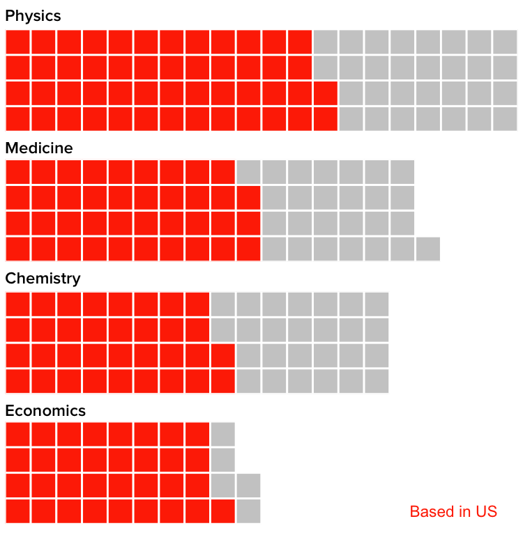
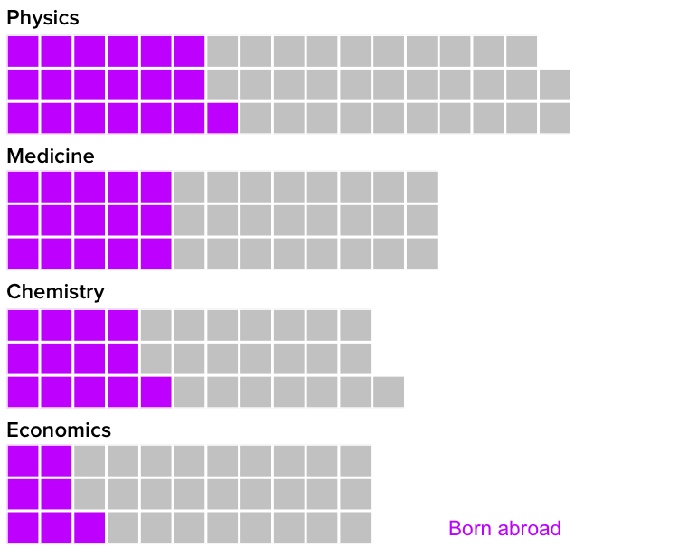
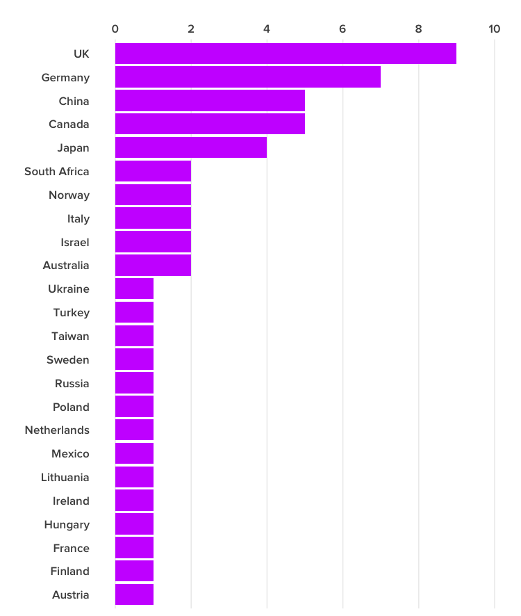

# These Nobel Prizewinners Show Why Immigration Is So Important For American Science

```{r knitr_options, include=FALSE}
library(knitr)
opts_chunk$set(out.width="725px", dpi=300)
```

[R](https://www.r-project.org/) code for the analysis supporting [this January 31, 2017 BuzzFeed News article](https://www.buzzfeed.com/peteraldhous/immigration-and-science) on the importance of immigration into the US for science, based on an analysis of living Nobel prizewinners. Supporting files are in [this GitHub repository](https://github.com/BuzzFeedNews/2017-01-immigration-and-science).

## Data preparation
The following code loads and processes data from the [Nobelprize.org API](https://www.nobelprize.org/nobel_organizations/nobelmedia/nobelprize_org/developer/). It creates the following fields:

 *  `bornCountry2` This captures the current country for the laureate's place of birth. For example, it would make Ukraine the birth country of a scientist born within that nation's current borders during the Soviet era.
 * `us` Whether or not the scientist was at a US institution when the prize was awarded.
 * `born_us` Whether or not the scientist was born in the US.
 * `instance` Uniquely identifies each laureate/prize combination.

```{r, results="hide", warning=FALSE, message=FALSE}
# load required packages
library(readr)
library(dplyr)
library(tools)
library(stringr)
library(ggplot2)
library(waffle)
library(tidyr)

# load and process data
laureates <- read_csv("http://api.nobelprize.org/v1/laureate.csv") %>%
  mutate(us = ifelse(country=="USA", "USA", "Other"),
         born_us = ifelse(bornCountry=="USA", "USA", "Other"),
         bornCountry2 = ifelse(grepl("now ",bornCountry), word(bornCountry,-1), bornCountry),
         bornCountry2 = gsub(")","", bornCountry2),
         category = toTitleCase(category),
         instance = paste0(id,"_",year,"_",category))
# this selects only the first mentioned affiliation for each laureate/prize combination
laureates_dedupe <- subset(laureates,!duplicated(laureates$instance))
```

## Most living Nobel laureates were based in the US when they won their prizes

This code filters for living laureates and draws a waffle chart of laureates for the Physics, Medicine, Chemistry and Economics prizes, showing whether they were based in the US or elsewhere. One square represents one laureate.

```{r, results="hide", warning=FALSE, message=FALSE, fig.show="hide"}

# filter for living Nobel Prizewinners
living <- laureates_dedupe %>%
  filter(is.na(died) & gender != "org" & !is.na(country)) %>%
  mutate(age = (difftime(Sys.Date(),born, units = "weeks")/52))

# summarize the data
living_summary <- living %>%
  group_by(category,us) %>%
  summarize(count=n()) %>%
  spread(us, count)

# filter for each prize
chem_living <- living_summary %>%
  filter(category == "Chemistry")
econ_living <- living_summary %>%
  filter(category == "Economics")
med_living <- living_summary %>%
  filter(category == "Medicine")
phys_living <- living_summary %>%
  filter(category == "Physics")

# chart
chem_data <- c(`US`= chem_living$USA, `Other` = chem_living$Other)
chem <- waffle(chem_data, rows=4, 
               size=1,
               colors=c("#ff3300", "#cccccc"),
               title = "Chemistry",
               xlab = NULL,
               pad = 5) +
  theme(text=element_text(size=16, family="Proxima Nova Semibold"),
        legend.position="none")

econ_data <- c(`US`= econ_living$USA, `Other` = econ_living$Other)
econ <- waffle(econ_data, rows=4, 
               size=1,
               colors=c("#ff3300", "#cccccc"),
               title = "Economics",
               xlab = NULL,
               pad = 10) +
  theme(text=element_text(size=16, family="Proxima Nova Semibold"),
        legend.position="none") +
  annotate("text", x = 18, y = 1, label = "Based in US", size = 6, color = "#ff3300")

med_data <- c(`US`= med_living$USA, `Other` = med_living$Other)
med <- waffle(med_data, rows=4, 
              size=1,
              colors=c("#ff3300", "#cccccc"),
              title = "Medicine",
              xlab = NULL,
              pad = 3) +
  theme(text=element_text(size=16, family="Proxima Nova Semibold"),
        legend.position="none")

phys_data <- c(`US`= phys_living$USA, `Other` = phys_living$Other)
phys <- waffle(phys_data, rows=4, 
               size=1,
               colors=c("#ff3300", "#cccccc"),
               title = "Physics",
               xlab = NULL) +
  theme(text=element_text(size=16, family="Proxima Nova Semibold"),
        legend.position="none")


iron(phys,med,chem,econ)
```



## But of those US-based Nobel laureates, many were born in other countries

This code filters for living laureates who were based in the US at the time the prize was awarded, and draws a waffle chart of laureates for the Physics, Medicine, Chemistry and Economics prizes, showing whether they were born in the US or elsewhere. One square represents one laureate.

```{r, results="hide", warning=FALSE, message=FALSE, fig.show="hide"}
# filter for living prizewinners who were based in the US when the prize was awarded
living_us <- laureates_dedupe %>%
  filter(is.na(died) & gender != "org" & country == "USA")

# summarize the data
living_us_summary <- living_us %>%
  group_by(category,born_us) %>%
  summarize(count=n()) %>%
  spread(born_us, count)

# filter for each prize
chem_living_us <- living_us_summary %>%
  filter(category == "Chemistry")
econ_living_us <- living_us_summary %>%
  filter(category == "Economics")
med_living_us <- living_us_summary %>%
  filter(category == "Medicine")
phys_living_us <- living_us_summary %>%
  filter(category == "Physics")

# chart
chem_data <- c(`Other`= chem_living_us$Other, `US` = chem_living_us$USA)
chem <- waffle(chem_data, rows=3, 
               size=1,
               colors=c("#cc33ff", "#cccccc"),
               title = "Chemistry",
               xlab = NULL,
               pad = 8) +
  theme(text=element_text(size=16, family="Proxima Nova Semibold"),
        legend.position="none")

econ_data <- c(`Other`= econ_living_us$Other, `US` = econ_living_us$USA)
econ <- waffle(econ_data, rows=3, 
               size=1,
               colors=c("#cc33ff", "#cccccc"),
               title = "Economics",
               xlab = NULL,
               pad = 9) +
  theme(text=element_text(size=16, family="Proxima Nova Semibold"),
        legend.position="none") +
  annotate("text", x = 15.5, y = 1, label = "Born abroad", size = 6, color = "#cc33ff")

med_data <- c(`Other`= med_living_us$Other, `US` = med_living_us$USA)
med <- waffle(med_data, rows=3, 
              size=1,
              colors=c("#cc33ff", "#cccccc"),
              title = "Medicine",
              xlab = NULL,
              pad = 7) +
  theme(text=element_text(size=16, family="Proxima Nova Semibold"),
        legend.position="none")

phys_data <- c(`Other`= phys_living_us$Other, `US` = phys_living_us$USA)
phys <- waffle(phys_data, rows=3, 
               size=1,
               colors=c("#cc33ff", "#cccccc"),
               title = "Physics",
               xlab = NULL,
               pad = 3) +
  theme(text=element_text(size=16, family="Proxima Nova Semibold"), 
        legend.position="none")

iron(phys,med,chem,econ)
```




## Here's where those immigrant Nobelists were born

This code filters for living laureates who were based in the US at the time the prize was awarded but were born in other countries, and draws a bar chart showing the numbers by country of origin.

```{r,warning=FALSE, message=FALSE, fig.show="hide"}
# filter and summarize data
living_us_foreign <- living_us %>%
  filter(bornCountry != "USA") %>%
  group_by(bornCountry2) %>%
  summarize(count=n())

# some text cleaning
living_us_foreign$bornCountry2 <- gsub("United Kingdom", "UK", living_us_foreign$bornCountry2)
living_us_foreign$bornCountry2 <- gsub("the Netherlands", "Netherlands", living_us_foreign$bornCountry2)

# bar chart
ggplot(living_us_foreign, aes(x=reorder(bornCountry2,count), y=count)) +
  geom_bar(stat="identity", fill = "#cc33ff") +
  theme_minimal(base_size = 16, base_family = "Proxima Nova Semibold") +
  theme(panel.grid.major.y = element_blank(),
        panel.grid.minor.y = element_blank(),
        panel.grid.minor.x = element_blank()) +
  xlab("") + ylab("") +
  scale_y_continuous(limits = c(0,10), breaks = c(0,2,4,6,8,10), position = "right") +
  coord_flip()
```



